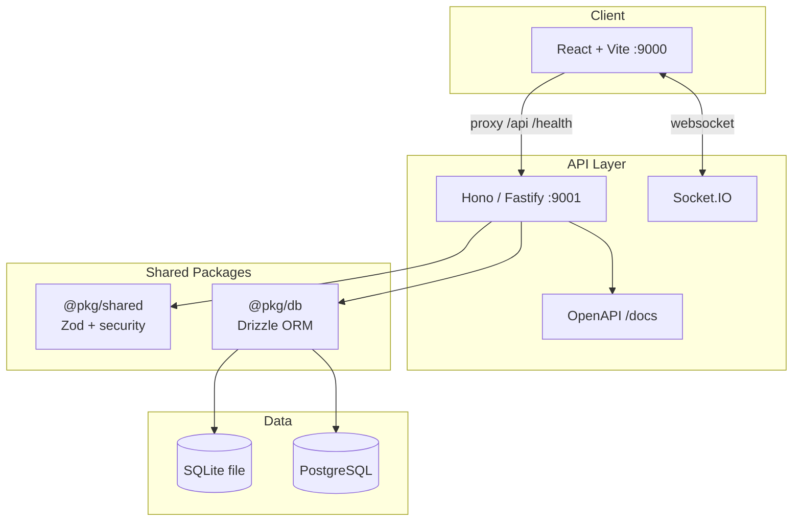
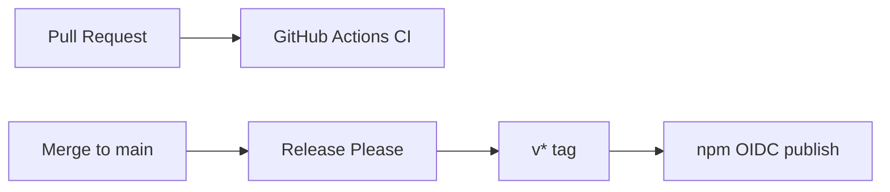

# Architecture

## System Overview

## CLI Flow (`template-create-ts`)

1. Copy `templates/default` → target directory
2. Replace `{{PROJECT_NAME}}`, `{{FRAMEWORK}}`, `{{DB_DIALECT}}`, `{{DATABASE_URL}}`
3. Select framework (Hono/Fastify) — copy `src/` + `package.json`
4. Optionally remove web app (`--no-web`) or heavy security deps (`--no-security`)
5. Generate `.env` with random `APP_SECRET`
6. Ensure `node_modules/` in `.gitignore`
7. `bun install` + optional post-scaffold `/health` smoke test

## Port Allocation

| Service | Port | Notes |
|---------|------|-------|
| Web (Vite) | 9000 | `strictPort: true` |
| API | 9001 | Socket.IO on same port |
| PostgreSQL | 5432 | Docker Compose only |
| Drizzle Studio | 4983 | Default |

## Health Check

`GET /health` returns:

- `status`: `ok` or `degraded` (based on DB ping)
- `database.status`: result of `SELECT 1` via Drizzle
- `framework`: `hono` or `fastify`

## Security Tiers

| Script | Tools |
|--------|-------|
| `security:quick` | OSV, lockfile-lint, depcheck |
| `security:full` | quick + Snyk, NodeSecure, bun-scan |

## Release Pipeline

